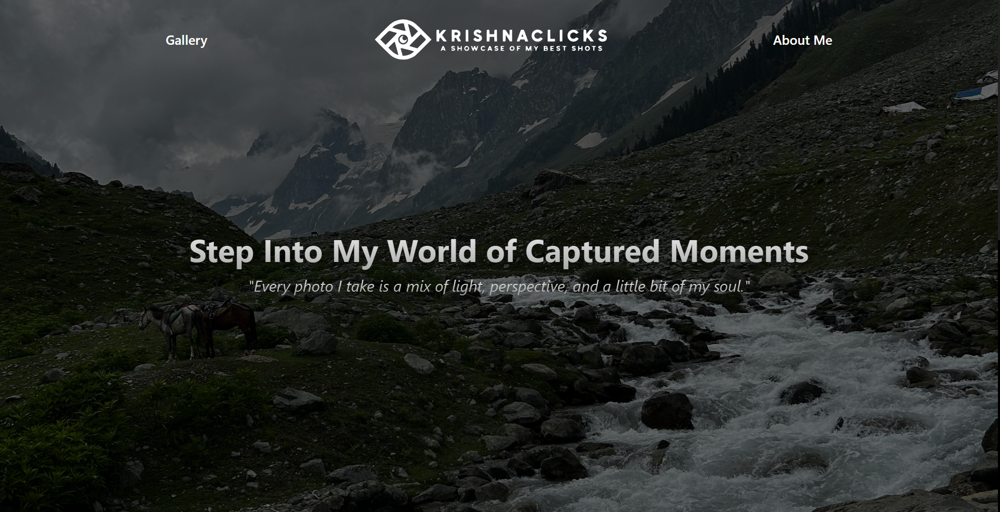
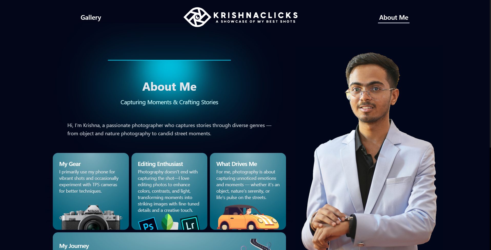
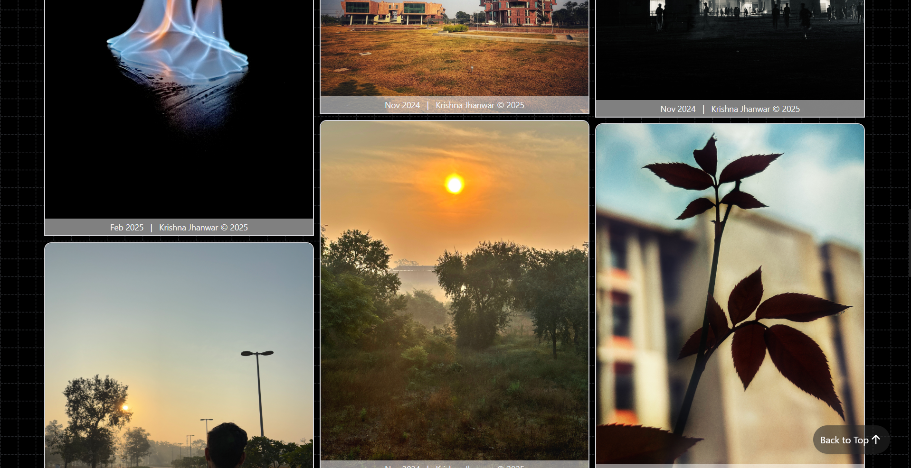

# KrishnaClicks Website
KrishnaClicks is a personal photography portfolio showcasing moments captured through my lens. This site reflects my passion for storytelling through visuals — ranging from landscapes and portraits to street and abstract photography.

Feel free to explore, get inspired, and connect!

## 🚀 Live Application
https://krishnaclicks.onrender.com/

<div style="display: flex; align-items: center; justify-content: space-evenly; flex-wrap: wrap; gap: 1rem">
    
    
    
</div>

## 🎁 Personalization
Feel free to fork this repository and customize it to build your own photography portfolio — update the content, swap the images, and tweak the design to reflect your style.

If you find it helpful and end up using it, a little mention or credit would mean a lot — but no pressure. Just happy to see it put to good use!

## 🛠️ Tech Stack
- **Frontend:** React.js, HTML5, CSS3, Tailwind CSS, Aceternity UI, Magic UI
- **Backend:** Node.js, Express.js
- **Database:** MySQL
- **APIs:** RESTful API design
- **Hosting:** Render, Koyeb, HelioHost

## 📂 Project Structure
The project is divided into two main parts: the client (frontend) and the server (backend).

## ⚙️ Setup and Installation
Clone the repository & enter the KrishnaClicks directory.
```bash
git clone https://github.com/krishnaj01/KrishnaClicks.git
cd KrishnaClicks
```
### Client Setup
1. Install dependencies:
```bash
cd client
npm install
```

2. Set up environment variables:
*(Create a .env file in the client directory and add the following)*

```
VITE_BACKEND_URL='http://localhost:3000'
VITE_ADMIN=<your-admin-name>
VITE_HOME_HERO_IMAGE_ARRAY=<your-home-hero-image-array>  <!-- just separate the links by comma -->
VITE_HOME_BACKGROUND_IMAGE=<your-home-background-images>
```

3. Start the development server:
```bash
npm run dev
```

### Server Setup
1. Install dependencies:
```bash
cd server
npm install
```

2. Set up environment variables:
*(Create a .env file in the server directory and add the following)*

```
MYSQL_HOST=<your-mysql-host>
MYSQL_USER=<your-mysql-username>
MYSQL_PASSWORD=<your-mysql-password>
MYSQL_DATABASE=<your-database-name>

ADMIN_USERNAME=<your-admin-username>
ADMIN_PASSWORD=<your-admin-password>

JWT_SECRET=<your-jwt-secret>

PORT=3000
FRONTEND_URL=http://localhost:5173
```

3. Start the backend server:
```bash
npm run dev
```

## 📝 Contribution Guidelines
To contribute:
1. Fork the repository.
2. Create a new branch for your feature/bug fix.
3. Commit your changes with meaningful commit messages.
4. Push to your fork and submit a pull request.

## 📬 Contact
For any issues or suggestions, contact me at krishnaj@iitbhilai.ac.in